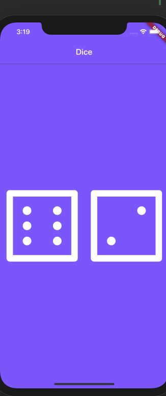
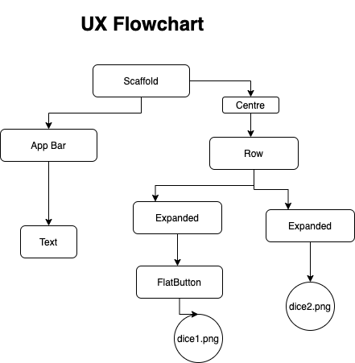

#DICE

Creating a dice flutter app

## Getting Started

We will design the app by using stateless and layout widgets, Expanded class and Image widgets. 
Use intention actions to pad image 
Detect user interaction  onPressed: (){}
FlatButton — around our 1st dice image
Stateful and stateless widgets

## What you will create

A dice rolling app which changes randomly when you click on it.

## INSTALLATIONS

### X-code

### Android Studio 

### Flutter

## UML DIAGRAM

 
For help getting started with Flutter, view 
[online documentation](https://flutter.dev/docs), which offers tutorials,
samples, guidance on mobile development, and a full API reference.
